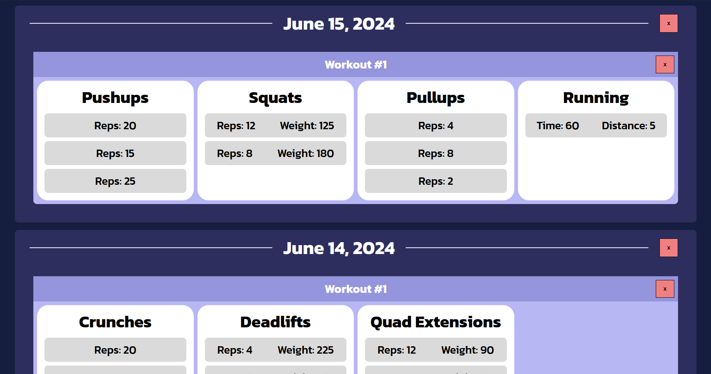

# Workout Tracker
This project is a workout tracker made using React.js, Node.js, and MongoDB. It features user authentication, the ability for users to add specific workouts, and the ability to create/keep track of goals. When adding a workout, users can specify the type of exercise, as well as how many sets and reps they completed. Tnis project is useful for those who want to keep track of their workouts.

## Features 
* Adding Workouts
* Manage Existing Workouts 
* Add Goals
* Automatic Progress Evaluation 
* Manage Existing Goals 
* Streak System

## Screenshots & Demo
### Screenshots

## Portfolio Properties
- showOnPortfolio = true
- path = documentation/
